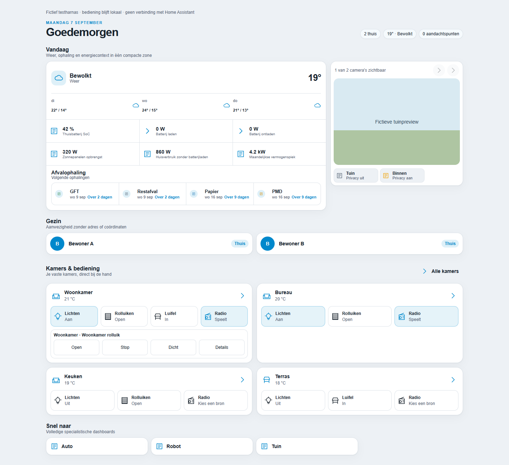
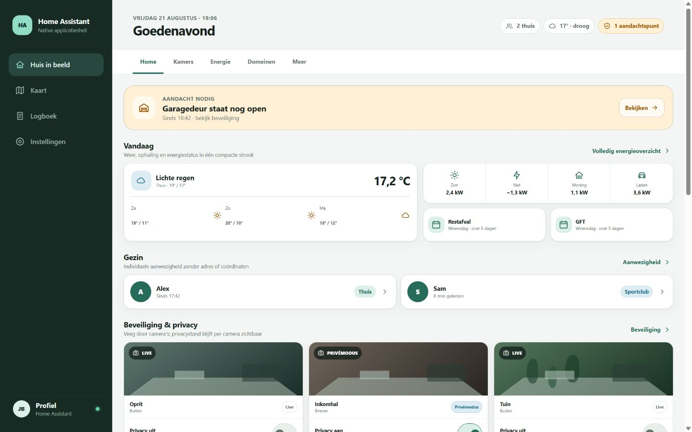
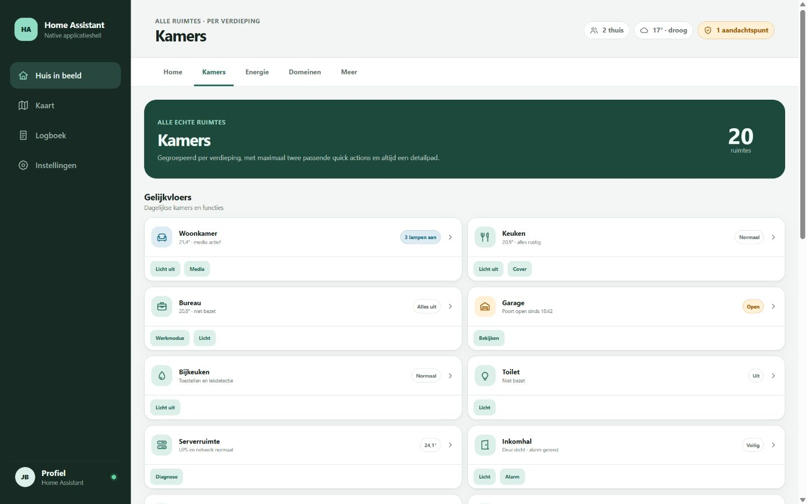
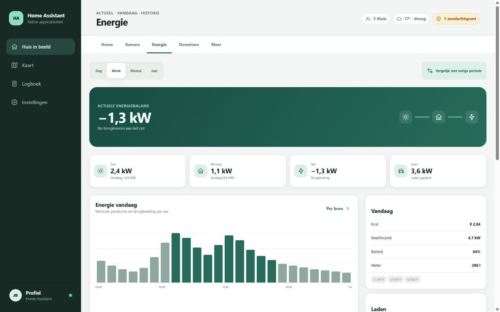

# Home Dashboard — ontwerpvoorstel

Testcandidate **v0.8.0-alpha.26** lost het herhaaldelijk opgetrokken bundlebudget structureel op: de configuratie-editor is uitgesplitst naar een eigen, lazy geladen bundle (`dist/home-dashboard-editor.js`) en de hoofdbundel-grens daalt van 260 kB naar 210 kB. Geen functionele wijziging voor wie het dashboard bekijkt; de editor werkt ongewijzigd, nu gewoon on-demand geladen. Zie de [testchecklist en rollback](docs/releases/testing-v0.8.0-alpha.26.md).

Testcandidate **v0.8.0-alpha.25** laat een kamerfoto rechtstreeks uploaden vanuit de kamereditor, via Home Assistants native media-selector — geen HA-hulpmiddel meer nodig vooraf. De bestaande `image_entity`-koppeling blijft werken als alternatief/terugval. Live Home Assistant-acceptatie blijft een afzonderlijke gate, met als extra aandachtspunt de nog niet live geverifieerde vorm van de onderliggende media-resolutie. Zie de [testchecklist en rollback](docs/releases/testing-v0.8.0-alpha.25.md).

Testcandidate **v0.8.0-alpha.9** gebruikt één navigatiebalk op dezelfde plek en met dezelfde maat in alle views, kiosk zonder extra frontendresource en een beheerderstandwiel voor de native dashboardeditor. Zie de [testchecklist en rollback](docs/releases/testing-v0.8.0-alpha.9.md) en de [volledige testscope en runtimegrenzen](docs/releases/testing-navigation-consistency.md). De onderstaande alpha.8-beschrijving beschrijft de eerdere release.

Werkcandidate **v0.8.0-alpha.8** maakt de interne navigatie standaard zichtbaar in de gekleurde balk. Kiosk gebruikt dezelfde vijf routes en kan met de optionele kiosk-mode-resource de HA-bovenbalk verbergen. De specialistische snelkoppelingen onder de afvalophaling zijn grotere kaarten met icoontegel, context en pijl. Zie de [actuele renders](docs/renders/expandable-rooms/README.md) en [testchecklist](docs/releases/testing-v0.8.0-alpha.8.md).

Testrelease **v0.8.0-alpha.2** voegt een bredere Home-weergave en uitklapbare kamerpanelen met vijf soorten chips toe. [Renders en validatie](docs/renders/expandable-rooms/README.md) en de [testchecklist](docs/releases/testing-v0.8.0-alpha.2.md) beschrijven de nieuwe bediening.

> Actuele ontwerprichting (7 september 2026): [vaste kamerbediening, rustige dataversheid en behoud van afvalophaling](docs/design/room-controls-direction.md). Dit besluit heeft voor deze onderwerpen voorrang op de eerdere ontwerpbaseline hieronder; implementatie volgt afzonderlijk.

Deze repository bouwt een HACS-installeerbare community dashboard strategy. **v0.8.0-alpha.1** voegt vaste favoriete kamerkaarten, expliciete licht-/cover-/luifel-/radiobediening en rustige dataversheid toe. Afvalophaling en voorspelling blijven behouden. Bestaande configuraties activeren geen bediening automatisch.

- [Instellen en testchecklist](docs/releases/testing-v0.8.0-alpha.1.md)
- [Actuele runtime-renders](docs/renders/room-controls/README.md)



## Aanbevolen richting

**Huis in beeld** gebruikt een app-like informatiehiërarchie op een native Home Assistant Sections-shell. De gewone Home Assistant-sidebar blijft de buitenste applicatieshell; binnen het dashboard staan vijf native views: Home, Kamers, Energie, Domeinen en Meer. Home toont aandacht, person cards en een scrollbare beveiligingsstrook met alle geconfigureerde camera's en hun privacystand. Kamers biedt het volledige overzicht met veilige quick actions. Kia, robotstofzuiger en tuin openen hun volledige bestaande HACS-card. De 3D-printer- en zwembadspecialisten zijn zelfstandig: beide registreren hun eigen samenvattingskaart zonder externe HACS-afhankelijkheid. De printerspecialist registreert daarnaast ook haar eigen volledige detailkaart; de zwembadspecialist beperkt zich vooralsnog tot de samenvatting — een uitgebreidere detailkaart volgt later.

V1 bevat geen custom panel en geen extra summary-component. De minimale ondersteunde versie is Home Assistant 2026.8.2. Diagnostiek verhuist bij voorkeur naar een apart admin-dashboard. Het default dashboard blijft read-only; een latere bouwfase werkt eerst op een vers, expliciet goedgekeurd testdashboard met snapshot en rollback.

## Begin hier

- [Finaal voorstel en startbasis](docs/design/final-proposal.md)
- [Dashboardvoorstel](docs/design/dashboard-proposal.md)
- [Conceptscorecard](docs/design/concept-scorecard.md)
- [Informatiearchitectuur](docs/design/information-architecture.md)
- [Designsysteem](docs/design/design-system.md)
- [Control Deck-kamercontract](docs/design/control-deck-room-dashboard.md)
- [Integratiestrategie](docs/design/integration-strategy.md)
- [Multi-agent implementatieplan](docs/design/implementation-plan.md)
- [Deliveryroadmap: agents, PR's, GUI, HACS en releases](docs/design/delivery-roadmap.md)
- [Projectkanban en Jira-achtige tickets](docs/planning/kanban.md)
- [Geconsolideerde browserregressiematrix](docs/quality/browser-regression-matrix.md)
- [Energy-paritymanifest](docs/quality/energy-parity-manifest.md)
- [Zwembadstatuscontract](docs/quality/pool-status-contract.md)
- [Responsive- en accessibility-QA](docs/quality/responsive-accessibility-qa.md)
- [Grafische configuratie](docs/configuration/gui-overview.md)
- [Gegenereerde views en read-only contract](docs/configuration/generated-views.md)
- [Home-configuratie](docs/configuration/home.md)
- [Security en camerastrook](docs/configuration/security.md)
- [Kamers en kamerdetails](docs/configuration/rooms.md)
- [Energie en Domeinen](docs/configuration/energy.md)
- [Specialistische kaarten](docs/configuration/specialists.md)
- [Kia-testchecklist](docs/releases/testing-v0.7.0-alpha.2.md)
- [Configuratieschema v1](docs/reference/config-schema.md)
- [Compatibility](docs/reference/compatibility.md)
- [Requirements en evidence](docs/discovery/requirements.md)
- [Informatiepariteit huidige dashboard](docs/discovery/current-dashboard-information-parity.md)

## Prototype

Het prototype is statische HTML/CSS/JavaScript met fictieve data en geen externe dependencies.

```sh
pnpm run serve
```

Open daarna `http://127.0.0.1:4173/`. De fixtureselector wisselt tussen normaal, waarschuwing en unavailable; de modusknop wisselt light/dark. De volledige [rendermatrix](docs/renders/README.md) bevat reproduceerbare URLs en afmetingen.







## HACS-installatie

[`v0.1.0-alpha.1`](https://github.com/ju1ced/home-dashboard/releases/tag/v0.1.0-alpha.1) heeft de volledige HACS-lifecycle doorlopen: installatie, update, verwijdering en herinstallatie. Zie [het geanonimiseerde resultaat](docs/releases/results-v0.1.0-alpha.1.md). De `v0.2`-reeks valideerde de GUI; de `v0.3`-reeks bracht de eerste views; latere alpha's breidden camera's, Home, Kamers en veilige kamerbediening uit. `v0.8.0-alpha.26` is de laatst getagde kandidaat: de configuratie-editor is uitgesplitst naar een eigen lazy geladen bundle, wat het hoofdbundelbudget structureel verlaagt; live Home Assistant-acceptatie blijft een afzonderlijke, nog goed te keuren validatiecyclus.

## Checks

Node.js 20 of nieuwer en pnpm 11:

```sh
pnpm install --frozen-lockfile
pnpm test
pnpm build
```

De check valideert TypeScript, de reproduceerbare HACS-bundle, JavaScript-syntax, vereiste deliverables, lokale Markdown-links, privacygevoelige patronen, fixtures en exacte PNG-afmetingen.

## Repository-indeling

```text
docs/discovery/   actuele toestand, evidence, referenties en requirements
docs/design/      concepten, selectie, voorstel, IA, systeem en bouwplan
docs/installation HACS-installatie en lifecycle
docs/releases/    testchecklists per prerelease
docs/renders/     gecontroleerde PNG-renders en rendermatrix
src/              TypeScript-bron voor de HACS-resource
dist/             getrackte reproduceerbare HACS-bundle
tests/            foundation- en later producttests
prototype/        interactieve high-fidelity prototype en fictief editorharnas
schemas/          versioned publieke JSON Schema's
config/examples/  privacyveilige normal/warning/missing/unavailable-fixtures
scripts/          lokale preview en repositorychecks
.github/          CI, HACS-validatie, releaseflow en templates
```

## Privacy en veiligheid

- Tracked bestanden bevatten alleen logische keys en fictieve waarden.
- Echte mappings, exports, snapshots en gegenereerde dashboardconfig blijven gitignored.
- Publiceer nooit entity-/device-ID's, serienummers, MAC-adressen, interne URLs, coördinaten, tokens of secrets.
- Het default dashboard `lovelace` is altijd read-only.
- Geen push, PR, release, deployment of HA-write zonder expliciete toestemming.

## Status

v0.8.0-alpha.26 lost het bundlebudget structureel op: de configuratie-editor is uitgesplitst naar een eigen, lazy geladen bundle (`dist/home-dashboard-editor.js`), waardoor de hoofdbundel-grens van 260 kB naar 210 kB kan dalen in plaats van telkens opnieuw opgetrokken te worden. Geen functionele wijziging voor dashboardgebruikers; de editor werkt ongewijzigd, alleen on-demand geladen. v0.8.0-alpha.25 voegde rechtstreekse kamerfoto-upload toe via Home Assistants native media-selector. De fixtures voeren geen live Home Assistant-write uit; deployment en runtimeacceptatie vereisen daarna nog de ingevulde menselijke gate uit de testchecklist.
