# Dashboardvoorstel — Huis in beeld

## Executive summary

Het aanbevolen dashboard is een rustige, attention-first Home Assistant-ervaring. De informatiearchitectuur voelt als een heldere woningapp, maar de implementatie blijft een native Sections-dashboard. Home beantwoordt steeds drie vragen: **vraagt iets aandacht, wat gebeurt er nu en wat wil ik doen?**

Vijf vaste hoofdviews — Home, Kamers, Energie, Domeinen en Meer — geven ruimtelijk geheugen. De gewone Home Assistant-sidebar blijft de applicatieshell; de vijf bestemmingen zijn native dashboardviews, geen tweede custom sidebar. Kamer-, domein- en specialistische details zijn subviews met stabiele semantische paths. Kia, robotstofzuiger en tuin openen hun volledige bestaande HACS-card. Zwembad krijgt een nieuwe volledige specialistische card in dezelfde familie. Diagnostiek verhuist uit het gezinspad naar een aanbevolen apart admin-dashboard.

V1 voegt geen eigen frontendcomponent toe. Zo blijven dagelijkse pagina's licht, toegankelijk en dicht bij het ondersteunde HA-platform. Het default dashboard blijft onaangeroerd; latere migratie verloopt via een vers testdashboard, snapshots en menselijke gates.

## Probleemdefinitie

Het huidige default dashboard is functioneel breed maar operationeel te zwaar. De 27 platte views, circa 454 kB configuratie, 52 globale resources en zeer grote Home-view mengen dagelijkse bediening met diagnostiek. Een gebruiker moet te veel scannen om te zien wat werkelijk aandacht vraagt. De bestaande specialistische kaarten zijn waardevol, maar robot is nog niet geïntegreerd en de totale ervaring mist één navigatie- en statusgrammatica.

## Aanbevolen concept

De gekozen richting combineert:

- App-like informatiehiërarchie en visuele curatie;
- Native-first Sections, Heading, Tile, Badge, Visibility, views en subviews;
- Hybrid's expliciete dependency-, fallback- en lifecyclecontract voor de drie bestaande cards;
- het bewezen publieke mapping- en privacyprincipe uit `juiced-dashboard`.

Deze richting won de gecorrigeerde scorecard met 8,30/10. De doorslag gaf het duidelijke gezinsmodel zonder de onderhoudskosten van een custom panel of vierde summaryresource.

## Home

Home gebruikt een vaste, niet-algoritmische volgorde:

1. **Aandacht** — kritieke items altijd; maximaal drie niet-kritieke waarschuwingen.
2. **Vandaag** — compacte weersverwachting, volgende relevante afvalinfo en globale energie-/laadstatus.
3. **Gezin** — individuele person cards met thuis, benoemde zone, onderweg/onbekend en dataversheid; device-batterij alleen bij aandacht.
4. **Beveiliging & privacy** — een horizontaal scrollbare strook met exact drie eigenaar-gekozen camera's, streamfallback, zichtbare privacystand en alarmstatus.
5. **Nu** — maximaal vier actieve uitzonderingen, zoals laden, schoonmaken of irrigeren.
6. **Acties** — start met `Avondscene` en een expliciet gemapt `Lichten beneden uit`-script.
7. **Actieve ruimtes** — maximaal vier contextuele kamers plus `Alle kamers`.
8. **Specialisten** — compacte native ingangen naar Kia, robot, tuin en zwembad.
9. **Domeinen** — maximaal vijf primaire ingangen; de rest onder Meer.

Normale toestand laat geen leeg waarschuwingsvak achter. Kritieke items verdwijnen nooit achter de limiet. Home toont uitsluitend de drie gekozen camera-previews, geen andere camerainventaris, uitgebreide grafieken, batterij-/updatelijsten, netwerkstatus, inventaris of volledige specialistische kaart. Privacy uitschakelen is een gevoelige actie met expliciete confirmation en backendautorisatie; een defecte stream blokkeert de overige kaarten niet.

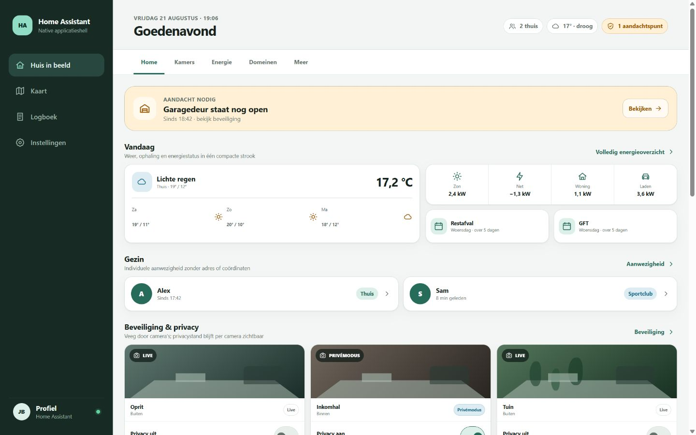

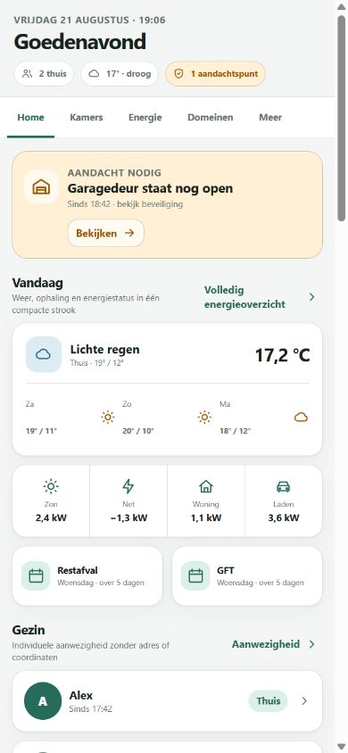

## Kamerpagina's

Iedere kamer volgt dezelfde grammatica, maar alleen geconfigureerde capabilities verschijnen. De door de eigenaar aangeleverde detailvoorbeelden maken volledige informatiepariteit verplicht:

1. heading, context en operationele waarschuwing;
2. primaire bediening voor licht, cover en klimaat;
3. media en benoemde scènes waar relevant;
4. comfort en aanwezigheid: temperatuur, vocht, CO₂/luchtkwaliteit, lux en optionele geluid/druk;
5. volledige ondersteunde HVAC-controls: setpoint, mode, preset, fan, swing en werkingsstatus;
6. safety en een expliciete camera-ingang;
7. relevante apparaten met veilige control, actueel vermogen, dagenergie en optionele spanning;
8. beslisrelevante comfort- en energiehistorie; diagnostiek als laatste route.

Een operationeel belangrijke `unavailable` blijft zichtbaar met begrijpelijke tekst en herstelroute. Een optionele diagnostische state verdwijnt. Kamerpagina's worden uit een klein, version-controlled capabilitymodel samengesteld; dit model wordt geen runtime rules engine.

### Kamers-overzicht

De hoofdview `rooms` toont alle door de eigenaar bevestigde kamers onder Gelijkvloers, Boven en Buiten. Iedere room summary bevat primaire status, maximaal twee passende quick actions en een afzonderlijke detailingang. Voorbeelden zijn een lichtactie, coverbediening of benoemde scène. Camera's, klimaatinstellingen met grote impact en brede/riskante acties blijven op detail. Niet-geconfigureerde controls verschijnen niet.

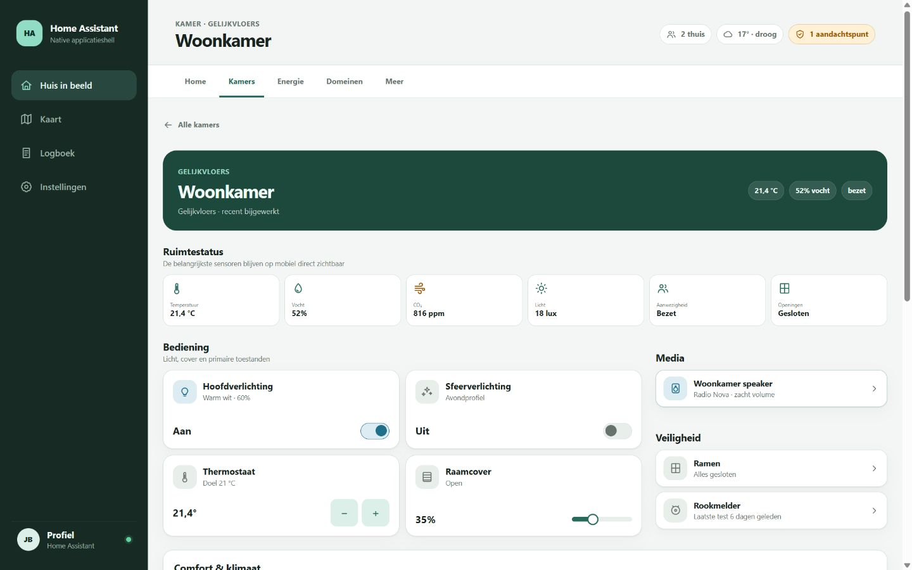

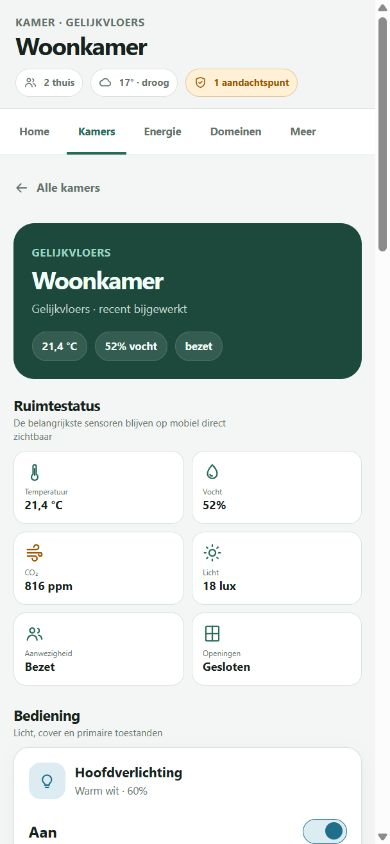

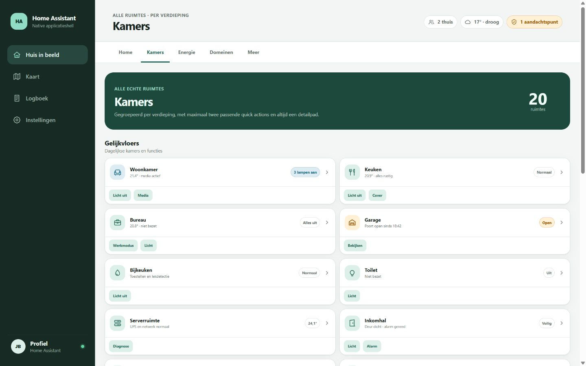

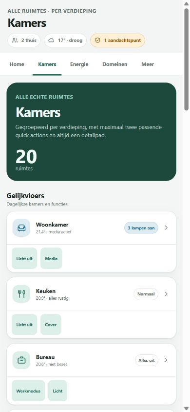

## Energie, domeinen en specialistische pagina's

`energy` is een zelfstandige volledige hoofdview met een hard paritycontract tegenover alle voor de installatie relevante standaard HA Energy-cards. Bovenaan staan actuele Power Sankey/balans, productie, netimport/-export, batterij/SoC en EV-laden. Historie behoudt datumselectie/vergelijking, usage, solar/forecast, bronnen en kosten, grid/solar/self-sufficiency/carbon gauges, apparaten total/detail en Energy Sankey. Gas en water verschijnen conditioneel wanneer geconfigureerd. Lokale aanvullingen zijn capaciteitspiek, fase-onbalans, EV-sessie/planning en UPS-context.

Woningbrede domeinen volgen: actuele toestand en uitzondering → veilige actie → compacte historie → details/diagnostiek. Beveiliging toont alarm en openingen vóór bediening; water toont lek/actueel gebruik vóór tarieven; zwembad toont waterkwaliteit en actieve modi vóór kostbare instellingen.

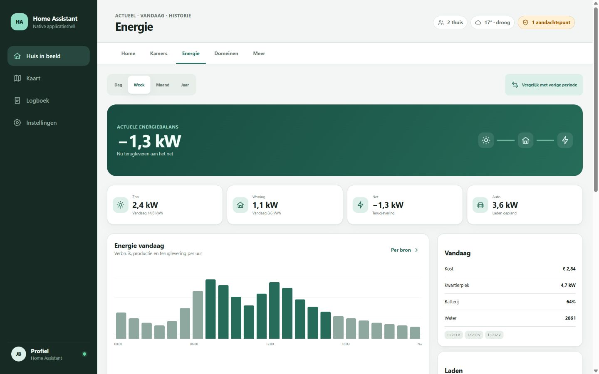

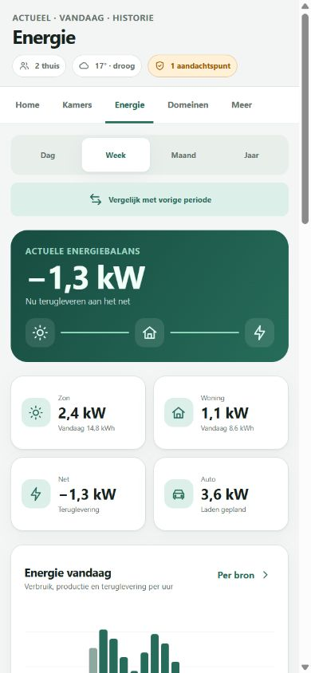

Kia, robot en tuin gebruiken dezelfde native subviewheader, spacing en statussemantiek. `Open details` toont daarna de volledige bestaande card full-width, inclusief de interne detailtabs en functies. Voor zwembad wordt een zelfstandige `custom:pool-dashboard-card` ontworpen met waterkwaliteit, filter, verwarming, energie, modi, veilige acties en diagnostics. De centrale repo dupliceert geen specialistische logica.

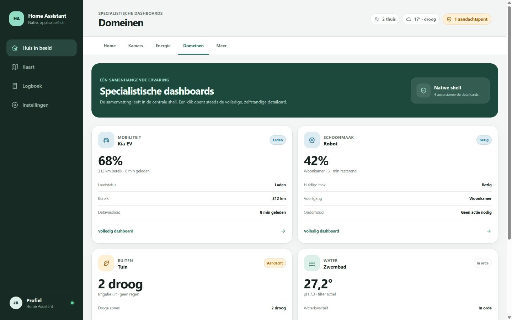

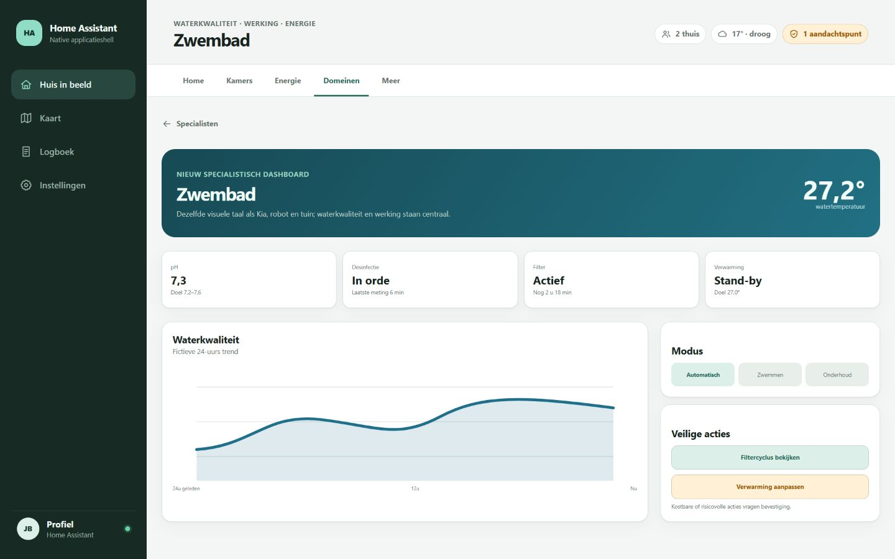

## Belangrijkste interacties

- Een statusvlak opent details of `more-info`; bediening heeft een eigen herkenbare control.
- Riskante, destructieve, privacygevoelige of kostbare acties blijven op detail en gebruiken confirmation plus backend-/scriptvoorwaarden.
- Hold mag extra frictie geven, maar is nooit de enige zichtbare affordance.
- Visibility verbergt alleen irrelevante presentatie; het verleent geen rechten.
- Contextuele blokken veranderen inhoud, niet willekeurig positie. De vaste volgorde ondersteunt ruimtelijk geheugen en screenreaders.

## Mobiel, tablet en desktop

- **Mobiel 390×844:** één kolom, aandacht en context in de eerste viewport, twee-koloms quick actions alleen wanneer 44×44 px targets en leesbare labels behouden blijven.
- **Tablet/wanddisplay:** twee of drie kolommen; waarschuwingen full-width, detailcards full-width, bevestigingsdialogen binnen bereik.
- **Desktop 1440×900:** maximaal vier rustige kolommen en begrensde leesbreedte; extra ruimte toont geen extra diagnostiek.
- Dense placement staat uit. DOM-, focus- en visuele volgorde blijven gelijk.
- Light en dark mode delen dezelfde semantiek. Status gebruikt tekst/icoon én kleur.

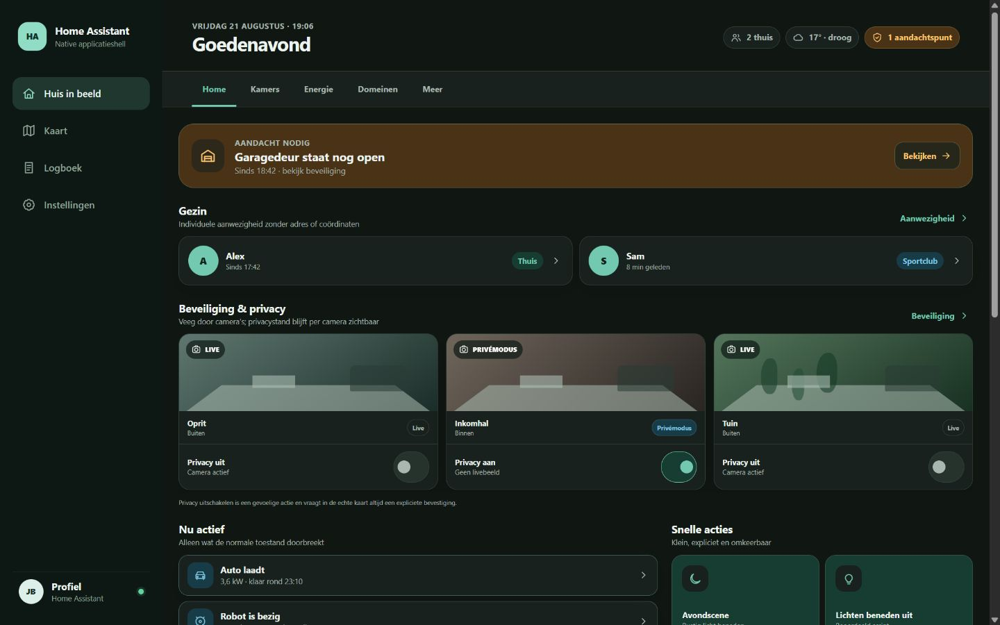

## Bewuste niet-keuzes

- Geen custom panel, eigen router, Python-integratie of Casa-kopie.
- Geen lokale summary-component in v1.
- Geen runtime entityherkenning of publieke mapping onder `/www`.
- Geen tweede custom sidebar in het dashboard; de gewone HA-sidebar blijft buiten de viewnavigatie.
- Geen brede `alles uit`-servicecall; alleen een specifiek, beoordeeld script kan later zo worden gelabeld.
- Geen pixelgelijke styling over Shadow DOM-grenzen.
- Geen resourceverwijdering voordat álle dashboards en dependencies zijn geaudit.

## Risico's en mitigaties

| Risico | Mitigatie / gate |
|---|---|
| Home groeit opnieuw | harde content- en entitybudgetten plus mobile first-viewporttest |
| Native summaries missen aggregaten | beheerde helper of upstream summarymode; geen frontendberekening |
| Robot blijft breed rerenderen | bronrepo-gate voor relevante states, fouten en mobiele tests |
| Globale resources kosten loadtijd | meten vóór en na; detail-only claim alleen voor DOM/updatekosten |
| Visibility wordt als beveiliging gezien | diagnostiek/admin via echte HA-rechten of apart `require_admin`-dashboard |
| Mapping mist area-loze functies | current-to-target matrix en eigenaarreview van definitieve kamerlijst |
| Renders lekken privacy | uitsluitend fictieve fixtures; privacyguard scant bron én rendersproces |
| Camerabediening verlaagt onbedoeld privacy | status vóór control, afzonderlijke control, confirmation bij privacy uit en backendautorisatie |
| Staging overschrijft afwijkende testconfig | verse export/snapshot, nieuw goedgekeurd testdashboard en rollbacktest |

## Conceptgate

De startkeuzes zijn vastgelegd in het [finale voorstel](final-proposal.md): `Avondscene` en het expliciet gemapte script `Lichten beneden uit` zijn de eerste Home-acties; diagnostiek/beheer krijgt een apart `require_admin`-dashboard. Een testdeployment blijft een afzonderlijke menselijke gate.
